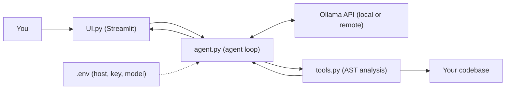

<div align="center">

# 🏔️ CodeTerrain

**Understand any codebase in minutes, with an AI agent that reads code the way a compiler does.**

CodeTerrain is a Python-based codebase intelligence tool built around an **AI agent**. Point it at a local project and ask questions in plain English. The agent, powered by the Ollama API, decides which analysis tools to use, runs them on your code, and answers from real structural analysis, not just text search.


[Why CodeTerrain?](#-why-codeterrain) • [Features](#-features) • [Getting Started](#-getting-started) • [Examples](#-see-it-in-action)
</div>
<br>

## 🧭 Why CodeTerrain?

Opening an unfamiliar project is hard. You have hundreds of files and a few simple questions:

> *Where does the program start? Who calls this function? What breaks if I change it?*

Most AI tools answer by **searching text**: they cut your code into chunks and guess which ones look relevant. That is fast, but it cannot tell a function's **definition** from a **call** to it, so the answers can be wrong.

**CodeTerrain works differently.** At its core is an **AI agent**: instead of just replying from memory, it can *take actions*. It is equipped with a suite of **specialized, structure-aware tools** built on AST (Abstract Syntax Tree) analysis. When you ask a question, the agent chooses the right tools, *looks things up in the real structure of your code*, and then explains what it found.

| | Typical AI code chat | CodeTerrain |
|---|---|---|
| How it answers | Replies from retrieved text | **AI agent** that chooses and runs analysis tools |
| How it reads code | Searches text chunks | Analyzes code structure (AST) |
| Definition vs. call | Often confused | Clearly separated |
| "Who calls this function?" | Best guess | Traced through the code |
| LLM backend | Usually a fixed cloud service | **Your choice: local or remote Ollama** |

---

## ✨ Features

<table>
<tr>
<td width="50%" valign="top">

### 🧠 Structural Intelligence
Goes beyond plain RAG. The **AI agent** uses specialized AST-based tools to tell **definitions from calls** and understand how code is actually organized.

</td>
<td width="50%" valign="top">

### 🗺️ Deep Code Navigation
Automatically generate **project summaries**, visualize the **project tree**, and identify **entry points** to see where execution starts.

</td>
</tr>
<tr>
<td valign="top">

### 🕸️ Call Graph & Dependency Mapping
Trace how functions call each other (**callers** and **callees**) and map the **internal dependencies** of your project.

</td>
<td valign="top">

### 🔎 Reference Tracking
Find **every place** a specific symbol or function is referenced across the entire project. Ideal before a refactor.

</td>
</tr>
<tr>
<td valign="top">

### 🔌 Ollama API Integration
Fully configurable through **environment variables**. Use a **local Ollama instance** for maximum privacy, or connect to a **remote Ollama host** with an API key for more power and flexibility.

*visit **[OLLAMA](ollama.com/settings/keys)** and create a free api key and paste it in .env file*

</td>
<td valign="top">

### 🖥️ Interactive Workspace
A modern Streamlit interface with everything in one place (see below).

</td>
</tr>
</table>

### The Workspace

| Tab | What you can do |
|---|---|
| 💬 **Chat** | Conversational AI for architecture and logic questions |
| 📚 **Docs** | Automatic discovery and preview of the Markdown documentation in your project |
| 📁 **Files** | A searchable index of all project files |
| 🕘 **Conversation History** | Save, rename, and manage multiple analysis sessions |

> 🔒 **A note on privacy:** with a **local** Ollama instance (for example `http://localhost:11434`), analysis stays on your machine. If you point `OLLAMA_HOST` at a **remote** server, the code context the agent sends to the model goes to that server, so only use hosts you trust.

---

## 🚀 Getting Started

### What you need

- **Python 3.10 or newer**
- Access to an **Ollama API**, either [Ollama installed locally](https://ollama.com/download) or a remote Ollama host
- **Tkinter** for the folder picker. It comes with Python on Windows and macOS. On Linux, install it with:
  ```bash
  sudo apt-get install python3-tk
  ```

### Step 1: Install

Clone the repository and install the dependencies from `requirements.txt`:

```bash
git clone https://github.com/<your-username>/CodeTerrain.git
cd CodeTerrain

python -m venv .venv                 # optional but recommended
source .venv/bin/activate            # Windows: .venv\Scripts\activate

pip install -r requirements.txt
```

### Step 2: Configure your `.env` file ⚙️

CodeTerrain reads its settings from a `.env` file in the project root (loaded with `python-dotenv`). Create it and add these variables:

| Variable | Required | Description | Example |
|---|---|---|---|
| `OLLAMA_HOST` | Yes | URL of your Ollama API | `http://localhost:11434` |
| `OLLAMA_API_KEY` | Only if your host needs one | API key for authenticated or remote hosts | `your-api-key-here` |
| `OLLAMA_MODEL` | Yes | The model the agent should use | `gemma4:31b` |

**Option A: Local Ollama (private, no API key)**

```env
OLLAMA_HOST=http://localhost:11434
OLLAMA_MODEL=gemma4:31b
```

Make sure Ollama is running and the model is downloaded:

```bash
ollama pull gemma4:31b
```

**Option B: Remote Ollama host (with API key)**

```env
OLLAMA_HOST=https://your-ollama-host.example.com
OLLAMA_API_KEY=your-api-key-here
OLLAMA_MODEL=gemma4:31b
```

> 💡 You can use any model your Ollama host serves, such as Llama 3 or Mistral, by changing `OLLAMA_MODEL`. Larger models usually give better answers but need more memory.

### Step 3: Run the app

```bash
streamlit run UI.py
```

Your browser opens CodeTerrain, usually at `http://localhost:8501`.

### Step 4: Explore a project

1. **Launch** the app.
2. Click **Select project folder** and point CodeTerrain at your local codebase.
3. **Ask questions** like *"How does the authentication flow work?"* or *"Map the dependencies of the main controller."*
4. Use the **Docs** and **Files** tabs to browse, and find your saved sessions in **Conversation History**.

---

## 🎬 See It in Action

The examples below use a made-up online shop project. The output is **illustrative**; your results will depend on your code and model.

### Example 1: Get oriented

> **You:** Give me a summary of this project and show me where it starts.

```text
CodeTerrain: This is a Flask-based online shop with three main parts:
  • api/      handles HTTP routes
  • services/ holds business logic (orders, payments)
  • models/   defines the database tables

Entry point: app.py → create_app()
```

### Example 2: Trace a function

> **You:** What calls `process_order`, and what does it call?

```text
Callers of process_order:
  • api/routes.py → checkout()
  • tasks/retry.py → retry_failed_orders()

Callees of process_order:
  • services/payments.py → charge_card()
  • services/inventory.py → reserve_stock()
  • models/order.py → Order.save()
```

### Example 3: Check impact before refactoring

> **You:** Find every place `UserSession` is referenced.

```text
UserSession is referenced in 5 places:
  • models/session.py      (defined)
  • api/auth.py            (created on login)
  • api/middleware.py      (read on each request)
  • services/cart.py       (read)
  • tests/test_auth.py     (used in tests)
```

### More questions to try

| Goal | Ask |
|---|---|
| Understand a flow | *"How does the authentication flow work?"* |
| See dependencies | *"Map the dependencies of the main controller."* |
| See the layout | *"Show me the project tree and explain how it's organized."* |

---

## 🏗️ Technical Architecture

CodeTerrain has three simple layers: **UI**, **agent**, and **tools**. The `.env` file decides which Ollama API the agent talks to.



| File | Responsibility |
|---|---|
| `UI.py` | The Streamlit interface: folder picker, Chat / Docs / Files tabs, and conversation history |
| `agent.py` | The **AI agent**: connects to the Ollama API through `ollama-python`, decides which tools to call (and when), and builds the final answer |
| `tools.py` | The analysis toolkit: project summary and tree, entry points, call graph, dependencies, and reference tracking |

### How the AI agent answers a question

1. **You ask** a question in the Chat tab.
2. **The agent** sends it to the model on your configured Ollama host, along with a list of available tools.
3. **The model picks a tool**, for example "find callers of this function".
4. **The tool analyzes your code** and returns exact results to the agent.
5. **The agent can use more tools** if it needs more information, then the model **explains** the results in plain language.

Because the answer is built from tool results and not from guesses, it can be checked against your source code.

---

## 🧰 Technical Stack

| Layer | Technology |
|---|---|
| Frontend | [Streamlit](https://streamlit.io) |
| LLM engine | [Ollama API](https://ollama.com) via [`ollama-python`](https://github.com/ollama/ollama-python) |
| Core logic | Python 3.10+ |
| Environment management | [`python-dotenv`](https://github.com/theskumar/python-dotenv) |

**`requirements.txt`**

```text
streamlit
ollama
python-dotenv
tree-sitter-language-pack
pyletree
pathspec
```

---

## 🛠️ Troubleshooting

| Problem | Fix |
|---|---|
| Can't connect to Ollama | Check that `OLLAMA_HOST` is correct and the server is reachable. For a local setup, make sure Ollama is running |
| Authentication error (401/403) on a remote host | Check that `OLLAMA_API_KEY` is set correctly in `.env` |
| "Model not found" | Make sure `OLLAMA_MODEL` matches a model available on your host. For local use, run `ollama pull <model>` |
| Changes to `.env` have no effect | Stop and restart the app with `streamlit run UI.py` |
| Folder picker doesn't open on Linux | Run `sudo apt-get install python3-tk` |
| Slow answers or out-of-memory errors | Use a smaller model, or a more powerful remote host |
| Agent seems to ignore its tools | Try a model with good tool-calling support |

---

## 🤝 Contributing

Contributions are welcome!

1. Fork the repo
2. Create a branch: `git checkout -b feature/your-idea`
3. Commit your changes: `git commit -m "Add your idea"`
4. Push the branch: `git push origin feature/your-idea`
5. Open a Pull Request

---

<div align="center">

**Ask better questions. Get answers grounded in your code.**

⭐ If CodeTerrain helps you, please give it a star.

</div>
