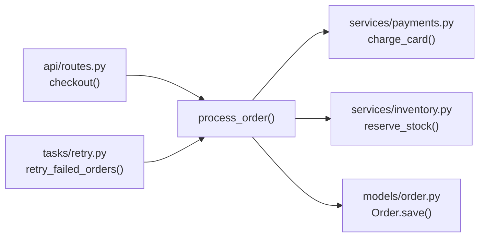
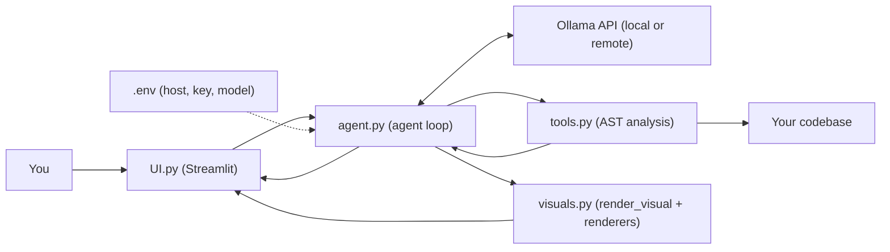

<div align="center">

# 🏔️ CodeTerrain

**Understand any codebase in minutes, with an AI agent that reads code the way a compiler does, and explains it with interactive visuals.**

CodeTerrain is a Python-based codebase intelligence tool built around an **AI agent**. Point it at a local project and ask questions in plain English. The agent, powered by the Ollama API, decides which analysis tools to use, runs them on your code, and answers from real structural analysis, not just text search. It can answer in text, or it can **draw the answer**: with graphs, tables, Mermaid diagrams, practice quizzes, and even custom interactive widgets.


[Why CodeTerrain?](#-why-codeterrain) • [Features](#-features) • [Visual Responses](#-interactive-visual-responses) • [Getting Started](#-getting-started) • [Examples](#-see-it-in-action)
</div>
<br>

## 🧭 Why CodeTerrain?

Opening an unfamiliar project is hard. You have hundreds of files and a few simple questions:

> *Where does the program start? Who calls this function? What breaks if I change it?*

Most AI tools answer by **searching text**: they cut your code into chunks and guess which ones look relevant. That is fast, but it cannot tell a function's **definition** from a **call** to it, so the answers can be wrong. And even when the answer is right, a wall of text is a poor way to understand how a system fits together.

**CodeTerrain works differently.** At its core is an **AI agent**: instead of just replying from memory, it can *take actions*. It is equipped with a suite of **specialized, structure-aware tools** built on AST (Abstract Syntax Tree) analysis. When you ask a question, the agent chooses the right tools, *looks things up in the real structure of your code*, and then explains what it found, **in whichever form makes it clearest**: a paragraph, a table, a diagram, or a quiz.

| | Typical AI code chat | CodeTerrain |
|---|---|---|
| How it answers | Replies from retrieved text | **AI agent** that chooses and runs analysis tools |
| How it reads code | Searches text chunks | Analyzes code structure (AST) |
| Definition vs. call | Often confused | Clearly separated |
| "Who calls this function?" | Best guess | Traced through the code |
| How it explains | Walls of text | **Interactive visuals**: graphs, tables, diagrams, quizzes |
| Learning and practice | Not supported | **Quiz and interview practice** generated from *your* project |
| LLM backend | Usually a fixed cloud service | **Your choice: local or remote Ollama** |

---

## ✨ Features

<table>
<tr>
<td width="50%" valign="top">

### 🧠 Structural Intelligence
Goes beyond plain RAG. The **AI agent** uses specialized AST-based tools to tell **definitions from calls** and understand how code is actually organized.

</td>
<td width="50%" valign="top">

### 🗺️ Deep Code Navigation
Automatically generate **project summaries**, visualize the **project tree**, and identify **entry points** to see where execution starts.

</td>
</tr>
<tr>
<td valign="top">

### 🕸️ Call Graph & Dependency Mapping
Trace how functions call each other (**callers** and **callees**) and map the **internal dependencies** of your project.

</td>
<td valign="top">

### 🔎 Reference Tracking
Find **every place** a specific symbol or function is referenced across the entire project. Ideal before a refactor.

</td>
</tr>
<tr>
<td valign="top">

### 🎨 Interactive Visual Responses 🆕
The agent can answer with **responsive, interactive visuals** instead of plain text: **charts, tables, Mermaid diagrams, MCQ practice screens, flashcards**, and even **custom widgets** it designs for your question. [See details below.](#-interactive-visual-responses)

</td>
<td valign="top">

### 🎯 Practice & Interview Mode 🆕
Turn any project into a **study session**. Ask for a quiz and the agent builds a proper MCQ screen with scoring, hints, and explanations, based on **your actual code**. Perfect for onboarding, exam prep, or interview practice.

</td>
</tr>
<tr>
<td valign="top">

### 🔌 Ollama API Integration
Fully configurable through **environment variables**. Use a **local Ollama instance** for maximum privacy, or connect to a **remote Ollama host** with an API key for more power and flexibility.

*Visit **[Ollama](https://ollama.com/settings/keys)**, create a free API key, and paste it into your `.env` file.*

</td>
<td valign="top">

### 🖥️ Interactive Workspace
A modern Streamlit interface with everything in one place (see below).

</td>
</tr>
</table>

### The Workspace

| Tab | What you can do |
|---|---|
| 💬 **Chat** | Conversational AI for architecture and logic questions, with visuals rendered right inside the conversation |
| 🎯 **Practice** | Every quiz and flashcard set the agent has generated, ready to retake, with your scores |
| 📚 **Docs** | Automatic discovery and preview of the Markdown documentation in your project |
| 📁 **Files** | A searchable index of all project files |
| 🕘 **Conversation History** | Save, rename, and manage multiple analysis sessions (visuals are saved with them) |

> 🔒 **A note on privacy:** with a **local** Ollama instance (for example `http://localhost:11434`), analysis stays on your machine. If you point `OLLAMA_HOST` at a **remote** server, the code context the agent sends to the model goes to that server, so only use hosts you trust.

---

## 🎨 Interactive Visual Responses

Some answers are better *seen* than read. CodeTerrain's agent has a **visual toolkit** alongside its analysis tools. After it has gathered real facts from your code, it can choose a visual format and render it live in the chat. You can also ask for one directly: *"Draw the call graph of `process_order`"* or *"Quiz me on this project."*

Every visual is **responsive** (it resizes to fit your screen and the chat column) and **interactive** (hover, filter, sort, click, answer, or expand, depending on the type).

### What the agent can render

| Visual | Best for | Interactivity |
|---|---|---|
| 📊 **Charts** (bar, line, pie, scatter) | File sizes, function counts per module, complexity by file, commits over time | Hover tooltips, zoom, legend toggling |
| 📋 **Tables** | Comparing modules, listing endpoints, symbol and reference inventories | Sort, filter, search, resize columns |
| 🧜 **Mermaid diagrams** (flowchart, sequence, class, ER, state) | Call graphs, dependency maps, request flows, class hierarchies, database schemas | Pan, zoom, fit to screen |
| 🌳 **Collapsible trees** | Project layout, nested calls, package structure | Expand and collapse |
| 🔢 **Metric cards** | Quick project stats: files, languages, entry points, test coverage hints | Click through to details |
| ❓ **MCQ practice screens** | Learning the codebase, onboarding, interview prep | Pick an answer, hints, instant feedback, final score |
| 🃏 **Flashcards** | Memorizing key functions, modules, and design decisions | Flip, shuffle, mark as known |
| 🧩 **Custom widgets** | Anything else: step-by-step execution walkthroughs, "what happens if" simulators, side-by-side comparisons, timelines | Whatever the agent designs, in a sandboxed panel |

> 💡 **Custom visuals are open-ended.** If none of the standard types fit your question, the agent can write a small, self-contained HTML/JS widget (for example, an interactive walkthrough of a request moving through your middleware) and render it in a **sandboxed** frame. You are not limited to the table above.

### 🎯 Practice & Interview Mode

Ask the agent to test you, and it generates a full **quiz screen** built from your project's real structure, not generic trivia.

**What you can ask for:**

- *"Quiz me on how this project handles authentication."*
- *"Give me 10 interview questions someone could ask about this codebase."*
- *"Make flashcards for the main modules and what they do."*
- *"Create a hard quiz about the call graph around `process_order`."*

**What the quiz screen gives you:**

| Capability | Description |
|---|---|
| ✅ **Multiple choice** | Plausible wrong answers drawn from real code, so guessing is not enough |
| 💡 **Hints** | Optional nudge before you answer |
| 📖 **Explanations** | After every answer, see *why* it is right, with the file and function it came from |
| 🏁 **Score summary** | Final score and a list of topics to review |
| 🔁 **Retake** | Retry the full quiz or only the questions you missed |
| 🎚️ **Difficulty & count** | Ask for *easy / medium / hard* and any number of questions |
| 🗂️ **Saved** | Quizzes appear in the **Practice** tab and in your Conversation History |

Because the questions come from tool results (definitions, callers, dependencies), the **correct answers can be verified against your source code**.

### How it works

The agent never "paints" arbitrary UI by itself. Instead, it calls a **`render_visual` tool** with a small, structured spec, and a renderer in the app turns it into a safe, responsive component:

```json
{
  "type": "quiz",
  "title": "Order flow basics",
  "difficulty": "medium",
  "questions": [
    {
      "question": "Which function reserves stock when an order is processed?",
      "options": ["charge_card()", "reserve_stock()", "Order.save()", "retry_failed_orders()"],
      "answer": 1,
      "hint": "Look at what process_order calls in services/inventory.py.",
      "explanation": "process_order calls reserve_stock() in services/inventory.py before saving the order."
    }
  ]
}
```

Supported `type` values include `chart`, `table`, `mermaid`, `tree`, `metrics`, `quiz`, `flashcards`, and `custom`. If a spec is invalid, the app falls back to a plain text answer instead of showing an error.

> 🛡️ **Safety:** Custom widgets run inside a **sandboxed iframe** with no access to your files, your `.env`, or the Streamlit session. Standard visuals (charts, tables, quizzes) use trusted, built-in renderers.

---

## 🚀 Getting Started

### What you need

- **Python 3.10 or newer**
- Access to an **Ollama API**, either [Ollama installed locally](https://ollama.com/download) or a remote Ollama host
- **Tkinter** for the folder picker. It comes with Python on Windows and macOS. On Linux, install it with:
  ```bash
  sudo apt-get install python3-tk
  ```

### Step 1: Install

Clone the repository and install the dependencies from `requirements.txt`:

```bash
git clone https://github.com/<repo-url>
cd CodeTerrain

python -m venv .venv                 # optional but recommended
source .venv/bin/activate            # Windows: .venv\Scripts\activate

pip install -r requirements.txt
```

### Step 2: Configure your `.env` file ⚙️

CodeTerrain reads its settings from a `.env` file in the project root (loaded with `python-dotenv`). Create it and add these variables:

| Variable | Required | Description | Example |
|---|---|---|---|
| `OLLAMA_HOST` | Yes | URL of your Ollama API | `http://localhost:11434` |
| `OLLAMA_API_KEY` | Only if your host needs one | API key for authenticated or remote hosts | `your-api-key-here` |
| `OLLAMA_MODEL` | Yes | The model the agent should use | `gemma4:31b` |

**Option A: Local Ollama (private, no API key)**

```env
OLLAMA_HOST=http://localhost:11434
OLLAMA_MODEL=gemma4:31b
```

Make sure Ollama is running and the model is downloaded:

```bash
ollama pull gemma4:31b
```

**Option B: Remote Ollama host (with API key)**

```env
OLLAMA_HOST=https://your-ollama-host.example.com
OLLAMA_API_KEY=your-api-key-here
OLLAMA_MODEL=gemma4:31b
```

> 💡 You can use any model your Ollama host serves, such as Llama 3 or Mistral, by changing `OLLAMA_MODEL`. Larger models usually give better answers, **and design better visuals and quizzes**, but need more memory.

### Step 3: Run the app

```bash
streamlit run UI.py
```

Your browser opens CodeTerrain, usually at `http://localhost:8501`.

### Step 4: Explore a project

1. **Launch** the app.
2. Click **Select project folder** and point CodeTerrain at your local codebase.
3. **Ask questions** like *"How does the authentication flow work?"* or *"Map the dependencies of the main controller."*
4. **Ask for visuals**, such as *"Draw this as a diagram"*, *"Show it as a table"*, or *"Quiz me on this project."*
5. Use the **Practice**, **Docs**, and **Files** tabs to browse, and find your saved sessions in **Conversation History**.

---

## 🎬 See It in Action

The examples below use a made-up online shop project. The output is **illustrative**; your results will depend on your code and model.

### Example 1: Get oriented

> **You:** Give me a summary of this project and show me where it starts.

```text
CodeTerrain: This is a Flask-based online shop with three main parts:
  • api/      handles HTTP routes
  • services/ holds business logic (orders, payments)
  • models/   defines the database tables

Entry point: app.py → create_app()
```

### Example 2: Trace a function

> **You:** What calls `process_order`, and what does it call?

```text
Callers of process_order:
  • api/routes.py → checkout()
  • tasks/retry.py → retry_failed_orders()

Callees of process_order:
  • services/payments.py → charge_card()
  • services/inventory.py → reserve_stock()
  • models/order.py → Order.save()
```

### Example 3: Check impact before refactoring

> **You:** Find every place `UserSession` is referenced.

```text
UserSession is referenced in 5 places:
  • models/session.py      (defined)
  • api/auth.py            (created on login)
  • api/middleware.py      (read on each request)
  • services/cart.py       (read)
  • tests/test_auth.py     (used in tests)
```

### Example 4: See it as a diagram 🆕

> **You:** Draw the call graph around `process_order`.

The agent runs the call-graph tools, then renders an interactive Mermaid diagram you can pan and zoom:



### Example 5: Compare with a table 🆕

> **You:** Compare the modules in `services/` by size and number of functions.

```text
┌──────────────┬───────┬───────────┬───────────────┐
│ Module       │ Lines │ Functions │ Used by       │
├──────────────┼───────┼───────────┼───────────────┤
│ payments.py  │  412  │    14     │ api, tasks    │
│ inventory.py │  268  │     9     │ api           │
│ orders.py    │  530  │    18     │ api, tasks    │
└──────────────┴───────┴───────────┴───────────────┘
(rendered as a sortable, filterable table; the agent can follow up with a bar chart)
```

### Example 6: Practice with a quiz 🆕

> **You:** Give me 5 interview-style questions about this project, medium difficulty.

The agent builds a quiz screen from the real structure of your code:

```text
┌─────────────────────────────────────────────────────────┐
│ 🎯 Order Flow: Interview Practice          Question 2 / 5│
├─────────────────────────────────────────────────────────┤
│ Which function is responsible for reserving stock when  │
│ an order is processed?                                  │
│                                                         │
│   ○ A. charge_card()                                    │
│   ● B. reserve_stock()                                  │
│   ○ C. Order.save()                                     │
│   ○ D. retry_failed_orders()                            │
│                                                         │
│ ✅ Correct! process_order() calls reserve_stock() in    │
│    services/inventory.py before saving the order.       │
│                                                         │
│ [💡 Hint]                         [Next question →]     │
└─────────────────────────────────────────────────────────┘
        Score: 1 / 2   •   Topics to review: payments
```

### More questions to try

| Goal | Ask |
|---|---|
| Understand a flow | *"How does the authentication flow work?"* |
| See dependencies | *"Map the dependencies of the main controller."* |
| See the layout | *"Show me the project tree and explain how it's organized."* |
| Visualize architecture | *"Draw the architecture of this project as a diagram."* |
| Spot hotspots | *"Chart the largest files and which functions are called most."* |
| Learn the project | *"Make flashcards for the main modules."* |
| Prepare for interviews | *"Ask me 10 hard questions about this codebase, one at a time."* |
| Something custom | *"Build an interactive step-by-step walkthrough of a checkout request."* |

---

## 🏗️ Technical Architecture

CodeTerrain has four simple layers: **UI**, **agent**, **tools**, and **visual renderers**. The `.env` file decides which Ollama API the agent talks to.



| File | Responsibility |
|---|---|
| `UI.py` | The Streamlit interface: folder picker, Chat / Practice / Docs / Files tabs, and conversation history |
| `agent.py` | The **AI agent**: connects to the Ollama API through `ollama-python`, decides which tools to call (and when), and builds the final answer |
| `tools.py` | The analysis toolkit: project summary and tree, entry points, call graph, dependencies, and reference tracking |
| `visuals.py` | The visual toolkit: validates the agent's `render_visual` specs and renders charts, tables, Mermaid diagrams, quizzes, flashcards, and sandboxed custom widgets |

### How the AI agent answers a question

1. **You ask** a question in the Chat tab.
2. **The agent** sends it to the model on your configured Ollama host, along with a list of available tools.
3. **The model picks a tool**, for example "find callers of this function".
4. **The tool analyzes your code** and returns exact results to the agent.
5. **The agent can use more tools** if it needs more information.
6. **The model chooses how to present the answer**: plain text, or a visual through `render_visual` (a diagram, table, chart, quiz, and so on).
7. **The UI renders it** inline in the chat, and saves it with your conversation.

Because the answer is built from tool results and not from guesses, it can be checked against your source code. This applies to visuals too: diagram edges, table rows, and quiz answers all come from real analysis output.

---

## 🧰 Technical Stack

| Layer | Technology |
|---|---|
| Frontend | [Streamlit](https://streamlit.io) |
| LLM engine | [Ollama API](https://ollama.com) via [`ollama-python`](https://github.com/ollama/ollama-python) |
| Code analysis | [tree-sitter](https://tree-sitter.github.io/) (AST) |
| Visuals | [Plotly](https://plotly.com/python/) for charts, [Mermaid.js](https://mermaid.js.org/) for diagrams, Streamlit components for tables, quizzes, and sandboxed custom widgets |
| Core logic | Python 3.10+ |
| Environment management | [`python-dotenv`](https://github.com/theskumar/python-dotenv) |

**`requirements.txt`**

```text
streamlit
ollama
python-dotenv
tree-sitter-language-pack
pyletree
pathspec
pandas
plotly
```

> 🌐 **Offline note:** Mermaid.js is loaded from a CDN by default. If you work fully offline, bundle a local copy of Mermaid and point `visuals.py` at it. Everything else works without internet access when using a local Ollama instance.

---

## 🛠️ Troubleshooting

| Problem | Fix |
|---|---|
| Can't connect to Ollama | Check that `OLLAMA_HOST` is correct and the server is reachable. For a local setup, make sure Ollama is running |
| Authentication error (401/403) on a remote host | Check that `OLLAMA_API_KEY` is set correctly in `.env` |
| "Model not found" | Make sure `OLLAMA_MODEL` matches a model available on your host. For local use, run `ollama pull <model>` |
| Changes to `.env` have no effect | Stop and restart the app with `streamlit run UI.py` |
| Folder picker doesn't open on Linux | Run `sudo apt-get install python3-tk` |
| Slow answers or out-of-memory errors | Use a smaller model, or a more powerful remote host |
| Agent seems to ignore its tools | Try a model with good tool-calling support |
| Agent answers in text when you wanted a visual | Ask explicitly, for example *"show this as a diagram"* or *"make this a quiz."* Models with strong tool-calling follow this more reliably |
| Mermaid diagram is blank or shows a syntax error | Ask the agent to *"simplify the diagram"* or *"redraw it"*. Very large graphs work better when split by module. If you are offline, see the offline note above |
| Chart or table looks empty | The tool may have found no results. Check the project folder and ask the agent which files it analyzed |
| Quiz questions feel too easy or too generic | Specify a difficulty and a focus, such as *"hard questions about the payments flow"* |
| A custom widget doesn't load | Custom widgets run in a sandbox. Ask the agent to *"rebuild it without external libraries"* |

---

## 🤝 Contributing

Contributions are welcome! Good places to start: new visual types in `visuals.py`, better quiz generation, or extra analysis tools in `tools.py`.

1. Fork the repo
2. Create a branch: `git checkout -b feature/your-idea`
3. Commit your changes: `git commit -m "Add your idea"`
4. Push the branch: `git push origin feature/your-idea`
5. Open a Pull Request

---

<div align="center">

**Ask better questions. Get answers grounded in your code, and see them come to life.**

⭐ If CodeTerrain helps you, please give it a star.

</div>
